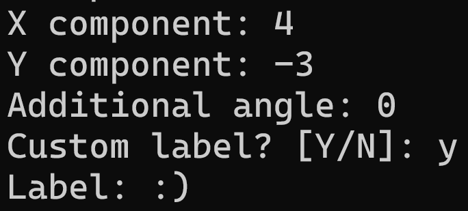

## Description

This PowerShell script is designed to facilitate the dynamic creation of vector graphs in LaTeX. Users can customize the X and Y components of the vector and specify an additional angle for the vector's arc. Additionally, users can choose to add a custom label to the graph for more control over the final result.

## Usage

1. Run the script `auto.bat`.
2. Follow the prompts to input the X and Y components of the vector.
3. Input any desired angle (θ) for the vector's arc. Note that this angle does not affect the vector's coordinates, only the arc displaying θ.
4. Choose whether to add a custom label to the graph.
   - If selected, enter the desired label when prompted. It can be a number or a string.
   - If not selected, a default label will be generated based on the X and Y components.
5. The script will automatically update the LaTeX file `Plot.tex` with the provided values and compile it using `pdflatex`.
6. Check the compilation status:
   - If successful, continues the process.
   - If there's an error, refer to the LaTeX file for details.
7. After successful compilation, you will be asked to choose between `PDF` or `Image` type of output.
   - PDF: input `1`. The PDF output file will open right after.
   - Image: input `2`. The script will convert the PDF to an image (JPG format by default) using ImageMagick.
8. Check the conversion status:
   - If successful, the resulting image will be opened for your review.
   - If there's an error, refer to the error message for details.

## Example

Input:

Output:

## Requirements

- ImageMagick: Ensure that ImageMagick is installed on your system. You can download it from [here](https://imagemagick.org/script/download.php).
- Ghostscript: Ghostscript is also required for certain ImageMagick operations. You can download it from [here](https://www.ghostscript.com/releases/gsdnld.html).

## License

This code is open for unrestricted use by anyone.

## Author

- **Deye**
