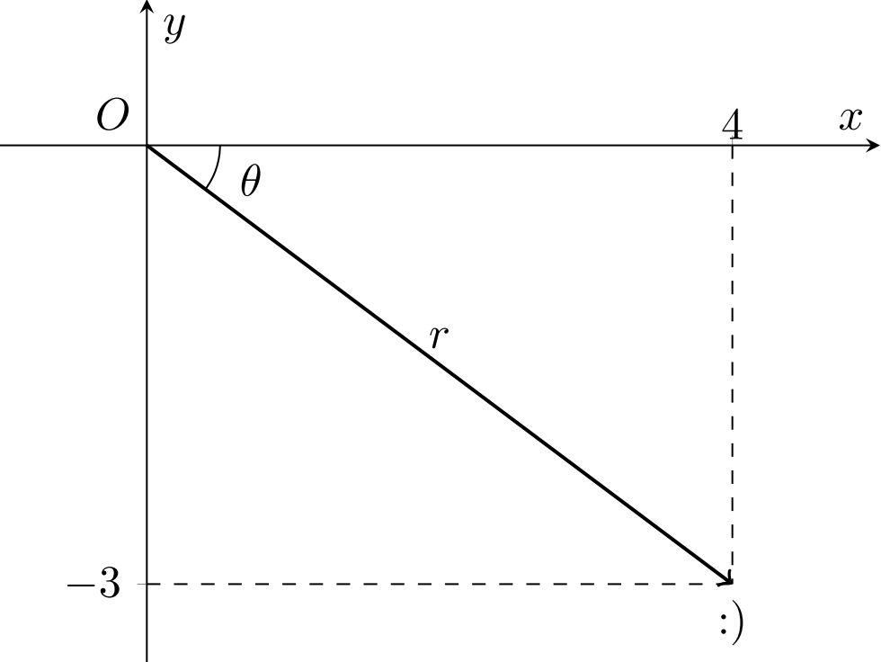

## Description

This branch includes a PowerShell script designed to facilitate the dynamic creation of vector graphs in LaTeX. Users can customize the X and Y components, as well as specify an additional angle for the vector. In addition, a custom label can be added to the graph, allowing more control over the  final result.

## Usage

1. Start `auto.bat`.
2. Follow the prompts to input the X and Y components of the vector.
3. Additionally, input any desired angle $\theta$ for the vector's arc. Note that this angle does not affect the vector's coordinates, only the arc displaying $\theta$.
4. Choose whether to add a custom label to the graph.
   - If selected, enter the desired label when prompted. It can be a number or a string.
   - If not selected, a default label will be generated based on the X and Y components.
5. The script will automatically update the LaTeX file `Plot.tex` with the provided values and compile it using `pdflatex`.
6. Check the compilation status:
   - If successful, the resulting PDF `Plot.pdf` will be opened for your review.
   - If there's an error, refer to the LaTeX file for details.
7. Feel free to customize the LaTeX file based on your necessities.

## Example

Prompt given:

Outbut:

## License

This code is open for unrestricted use by anyone.

## Author

- **Deye**
