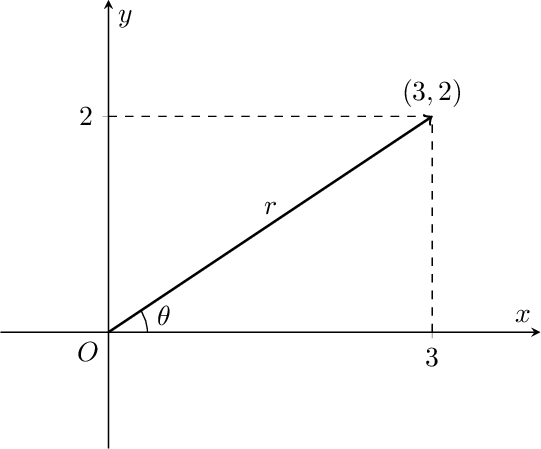
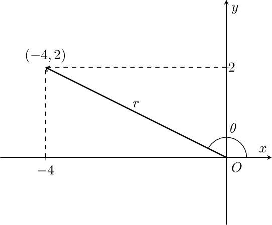
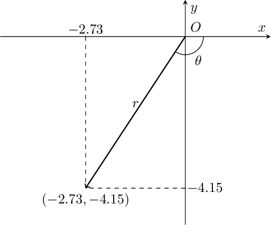
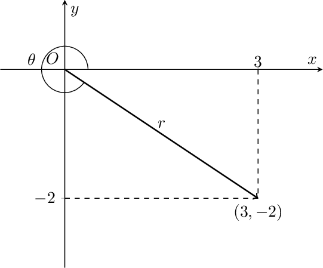

## Dynamic Vector Plot

This project implements a dynamic vector plot in a Cartesian plane using TikZ and PGFPlots in LaTeX.

## Description.

The provided LaTeX code allows you to generate a Cartesian graph with a dynamic vector based on specified values. The vector is represented by a point in the Cartesian plane, with its components and an angle $\theta$ shown in the graph.
With trivial substitutions it can also be adapted to the representation of complex numbers in the Gauss plane.
The distinctive feature of this code lies in its ability to dynamically adjust the anchoring of elements based on the vector, ensuring minimal overlap in labeling. This enhances both the clarity and aesthetic appeal of the generated plot.

## Usage

1. Change the values of \myx and \myy in the "Input Variables" section to customize the vector.
2. Modify the variable \aangle to introduce an arbitrary angle to the displayed arc. This feature proves particularly handy when stressing the supplementary angle to the default one. You can achieve this by specifying that the value of the \aangle variable should be +360 or -360, depending on the given conditions.

## Examples

## License.

This code is open for unrestricted use by anyone. No attribution is required.

## Author

- **Deye**
